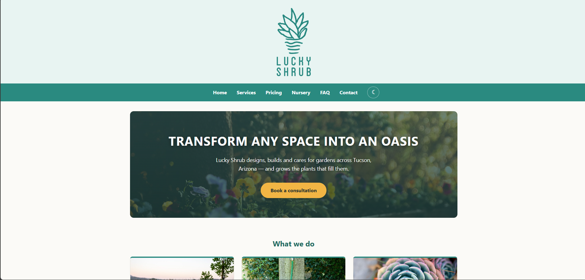
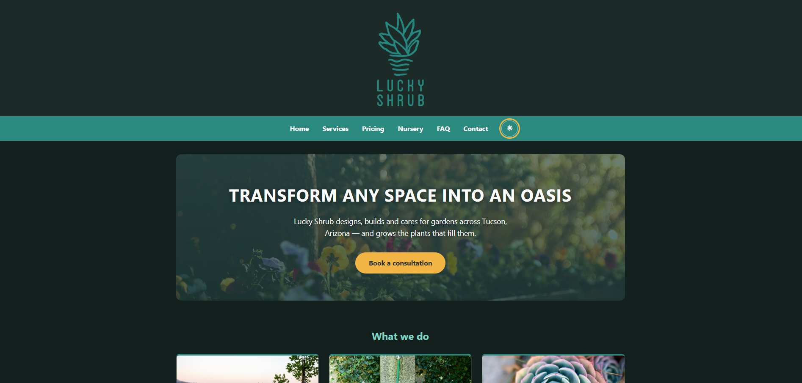
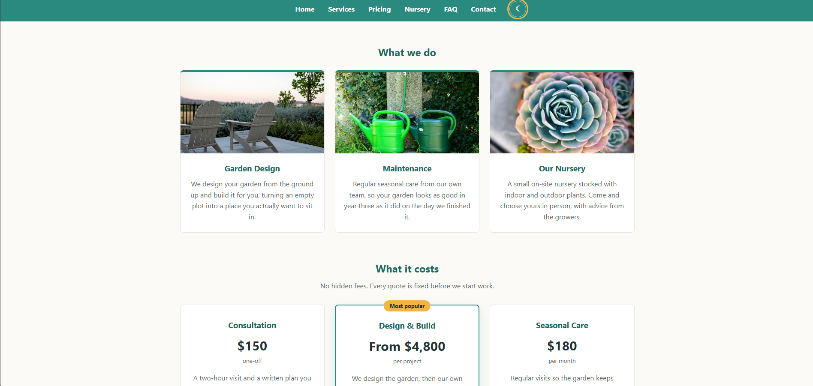
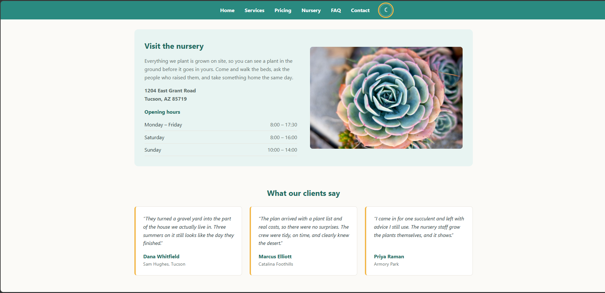

# Lucky Shrub

A responsive marketing site for a fictional garden design company and plant nursery in Tucson, Arizona.

The project exists in two forms in this repository:

- **`/`** — the current version, rebuilt in React with Vite
- **`/original`** — the first version, hand-written in plain HTML and CSS

Both render the same brand. The React version adds a mobile menu, a validated contact form, a pricing section, an FAQ accordion, dark mode and scroll animations.

> **Note:** Lucky Shrub is not a real business. The prices, address, phone number and testimonials on the site are placeholder content written for the project.

## Screenshots



The same page with dark mode enabled from the toggle in the navigation bar:



Services and pricing, with the middle tier highlighted:



The nursery details and client testimonials:



## Built with

- React 19
- Vite 8
- Plain CSS — no UI framework, no CSS-in-JS

## Running it locally

Requires Node 18 or newer.

```bash
npm install
npm run dev
```

Then open http://localhost:5173/

| Script | What it does |
| --- | --- |
| `npm run dev` | Start the dev server with hot reload |
| `npm run build` | Build for production into `dist/` |
| `npm run preview` | Serve the production build locally |
| `npm run lint` | Lint the source with Oxlint |

## Project structure

```
src/
├── main.jsx              Entry point
├── App.jsx               Page composition
├── App.css               All styles, themed with CSS custom properties
├── components/           One component per section of the page
├── data/                 Page content as plain arrays
└── hooks/
    └── useScrollReveal.js  IntersectionObserver reveal-on-scroll
```

Content lives in `src/data` rather than in the markup, so adding a service, a
price tier or an FAQ entry means adding an object to an array — the components
render whatever they are given.

## Features

**Layout**
- Responsive down to 320px using CSS Grid and Flexbox
- Sticky navigation on desktop, collapsible menu on mobile

**Interaction**
- Contact form with inline validation and a success state
- FAQ accordion with one panel open at a time
- Dark mode toggle, saved to `localStorage` and defaulting to the system setting
- Sections fade in on scroll via `IntersectionObserver`

**Accessibility**
- Semantic landmarks and a single `h1` per page
- `aria-expanded`, `aria-controls` and `aria-invalid` kept in sync with state
- Form errors linked to their inputs with `aria-describedby`
- Visible `:focus-visible` outlines throughout
- All motion disabled under `prefers-reduced-motion`
- Descriptive `alt` text on every image

## Known limitations

- The contact form validates input but does not send anything. Wiring it up
  would need a form service or a backend endpoint.
- The site is a single page; the navigation scrolls to anchors rather than
  routing between pages.

## Credits

Photographs are CC0 / public domain, sourced via the Openverse API — full list
in [`original/images/CREDITS.txt`](original/images/CREDITS.txt). The Lucky Shrub
logos are course assets from the Meta Front-End Developer programme.

## Author

Made by Mehdi Lakhouane
